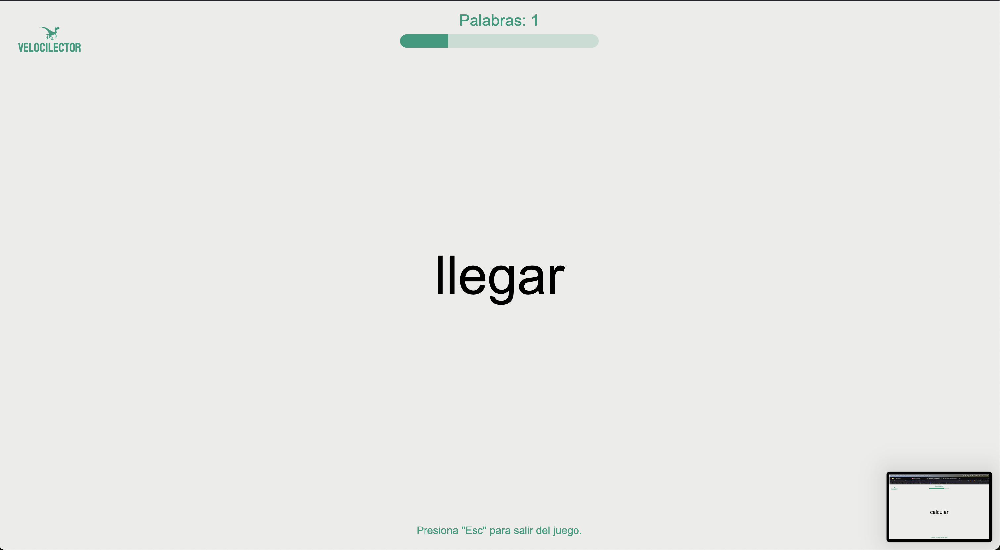

# Velocilector

**Velocilector** es un juego diseñado para ayudar a los niños a practicar la lectura rápida y mejorar su capacidad de reconocer palabras de forma automática. Es una herramienta simple, interactiva y efectiva para desarrollar habilidades de lectura.

## Características del Juego

- **Dos Modos de Juego:**
  1. **Modo Manual:** El usuario presiona la barra espaciadora para avanzar a la siguiente palabra.
  2. **Modo Automático:** Las palabras se muestran automáticamente cada 5 segundos, y el tiempo entre palabras disminuye un 5% cada 20 palabras para incrementar el desafío.

- **Contador de Palabras:** Lleva un registro de cuántas palabras ha leído el usuario.
- **Barra de Progreso:** Indica el tiempo restante antes de que se muestre la siguiente palabra.
- **Diseño Atractivo:** Interfaz limpia con colores suaves para facilitar el enfoque y evitar distracciones.
- **Función de Reinicio:** Presiona "Esc" en cualquier momento para volver al menú principal.

## Tecnologías Utilizadas

1. **HTML:** Estructura principal de la aplicación.
2. **CSS:** Estilización de la interfaz de usuario, incluyendo el diseño responsivo y colores.
3. **JavaScript:** Lógica del juego, manejo de eventos y control de temporizadores.

## Cómo Usar

1. **Inicio:** Al abrir el juego, selecciona el modo presionando `1` o `2`.
2. **Modo Manual:**
   - Presiona `Espacio` para avanzar palabra por palabra.
3. **Modo Automático:**
   - Observa cómo las palabras cambian automáticamente según el temporizador.
   - La barra de progreso te indica el tiempo restante antes de que aparezca la siguiente palabra.
4. **Salir:** Presiona `Esc` para regresar al menú principal en cualquier momento.

## Objetivo

**Velocilector** está diseñado para fomentar la práctica y el aprendizaje de la lectura rápida en un ambiente divertido y sencillo, ideal para niños que comienzan a desarrollar sus habilidades lectoras.

## Captura de Pantalla

## Créditos

Desarrollado como una herramienta educativa para mejorar las habilidades lectoras de los niños.

